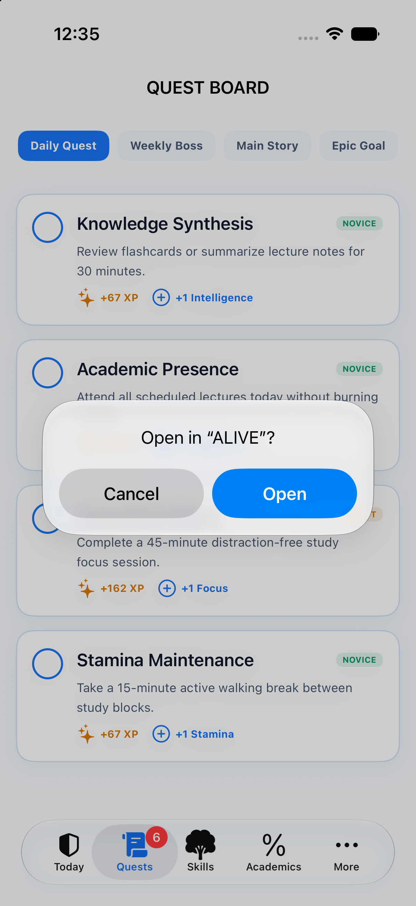
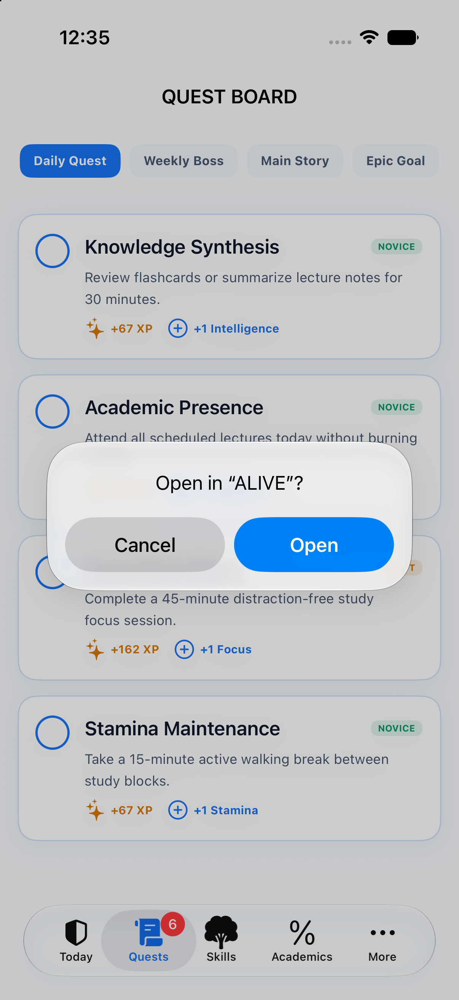
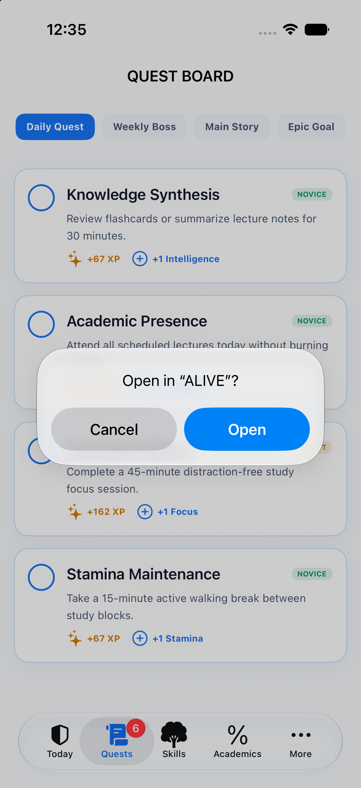
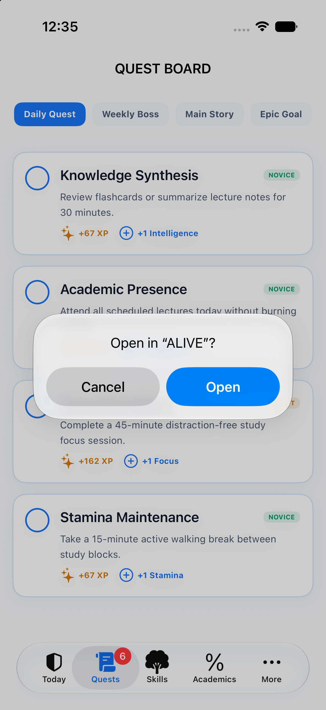
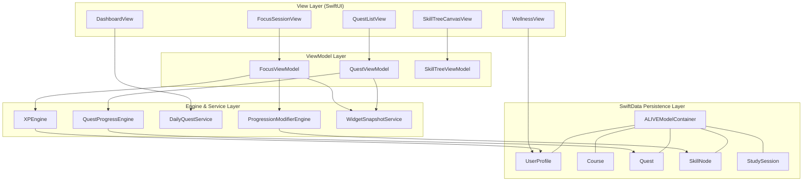

<div align="center">

<br/><br/>

# 🛡️ ALIVE ⚡

### *Gamified RPG Academic & Life Management System for iPhone*

[](https://swift.org)
[](https://apple.com/ios)
[](https://developer.apple.com/xcode/swiftdata/)
[](https://developer.apple.com/documentation/activitykit)
[](https://developer.apple.com/widgets/)
[](https://developer.apple.com/design/human-interface-guidelines/)
[](LICENSE)

<br/>

**ALIVE** turns daily student routines into an interactive Role-Playing Game (RPG).  
Students create a hero, earn XP through deep work focus sessions and daily quests, safeguard academic attendance thresholds, unlock progression perks in a visual skill canvas, and track momentum across their iPhone, Lock Screen, Dynamic Island, and Home Screen.

[App Showcase](#-app-showcase) • [Core Highlights](#-core-highlights) • [System Architecture](#-system-architecture) • [Getting Started](#-getting-started) • [Testing](#-unit-tests--verification)

</div>

---

## 📱 App Showcase

| 🛡️ Hero Dashboard & Heatmap | 📜 Quest Board | 🌳 Skill Tree Canvas |
| :---: | :---: | :---: |
|  |  |  |
| *Hero HUD, XP Progress & 28-Day Heatmap* | *Daily Quests, XP Rewards & Stat Boosts* | *Prerequisite Tree Lines & Perk Unlocks* |

| 📊 Academic Bunk Fortress | ⏱️ Flowstate Focus Timer | 👑 Achievement Vault |
| :---: | :---: | :---: |
|  |  |  |
| *Circular Gauges & Safe Bunk Calculator* | *Timer Ring Pulse & Live Activity Handoff* | *3D Card Flip Badges & Rarity Tiers* |

---

## 📋 Table of Contents

- [📱 App Showcase](#-app-showcase)
- [✨ Core Highlights](#-core-highlights)
- [🌟 Key Features](#-key-features)
  - [🔒 Biometric Authentication & Character Onboarding](#-biometric-authentication--character-onboarding)
  - [⚔️ RPG Character Classes & Attribute System](#️-rpg-character-classes--attribute-system)
  - [📊 Attendance Safeguard & Safe Bunk Engine](#-attendance-safeguard--safe-bunk-engine)
  - [📜 Quest System & Dynamic Rewards](#-quest-system--dynamic-rewards)
  - [🌳 Interactive Skill Tree Canvas](#-interactive-skill-tree-canvas)
  - [⏱️ Flowstate Focus Timer & Live Activities](#️-flowstate-focus-timer--live-activities)
  - [📱 Widgets, Siri Shortcuts & HealthKit](#-widgets-siri-shortcuts--healthkit)
- [🏗️ System Architecture](#-system-architecture)
  - [Data Flow Diagram](#data-flow-diagram)
  - [Directory Structure](#directory-structure)
- [🧮 Mathematical & Algorithmic Specifications](#-mathematical--algorithmic-specifications)
  - [1. Safe Bunk Margin Formula](#1-safe-bunk-margin-formula)
  - [2. Class Recovery Steps Formula](#2-class-recovery-steps-formula)
  - [3. Exponential XP Level Progression](#3-exponential-xp-level-progression)
- [🚀 Getting Started](#-getting-started)
- [🧪 Unit Tests & Verification](#-unit-tests--verification)
- [📄 License](#-license)

---

## ✨ Core Highlights

> [!IMPORTANT]
> **ALIVE** is built using **pure native Apple frameworks**: **SwiftUI**, **SwiftData**, **ActivityKit**, **WidgetKit**, **HealthKit**, **App Intents**, **UserNotifications**, and **LocalAuthentication**. Zero third-party runtime dependencies.

- 🔒 **Biometric Profile Security**: FaceID / TouchID gate for student profiles with quick demo seeding for hackathon evaluation.
- 🎭 **4 Character Archetypes**: Distinct stat builds (Scholar, Tech Architect, Creative Visionary, Academic Strategist).
- 📐 **Predictive Bunk Calculator**: Real-time algorithm calculating safe bunks and recovery classes required to avoid course short-attendance.
- 🌳 **Visual Skill Tree Canvas**: Canvas-rendered prerequisite lines, node unlock states, and passive buff stackers.
- 🗓️ **28-Day Streak Calendar**: GitHub-style activity contribution heatmap tracking study minutes and completed quests.
- 🏝️ **Live Activities & Dynamic Island**: Real-time focus session countdowns on Lock Screen and Dynamic Island via `ActivityKit`.
- 📱 **Home Screen Hero HUD Widget**: Live timeline widget displaying level, streak, XP progress, and active quests.
- 🎴 **3D Interactive Badges**: Achievement vault cards with 3D flip interaction to view unlock date and milestones.

---

## 🌟 Key Features

### 🔒 Biometric Authentication & Character Onboarding

Hero profiles are protected with native iOS biometric security ([`AuthService.swift`](ALIVE/Services/AuthService.swift), [`AuthViewModel.swift`](ALIVE/ViewModels/AuthViewModel.swift)):

- 🖐️ **Face ID / Touch ID Verification**: Uses `LocalAuthentication` framework for profile entry.
- 🧙‍♂️ **Character Creation Wizard** ([`CharacterCreationView.swift`](ALIVE/Views/Auth/CharacterCreationView.swift)): Custom hero name, class selection, base stat preview, and automated initial quest/skill seeding.

---

### ⚔️ RPG Character Classes & Attribute System

Students select a class archetype upon onboarding ([`CharacterClass.swift`](ALIVE/Models/CharacterClass.swift)). Each class defines a tailored base stat distribution:

| Character Class | Starting Build | Base Stats (INT / STA / FOC / DIS) |
| :--- | :--- | :---: |
| 📚 **Scholar** | Theory-first | `18 / 12 / 16 / 14` |
| ⚡ **Tech Architect** | Systems-minded | `16 / 14 / 18 / 12` |
| 🎨 **Creative Visionary** | Idea-driven | `14 / 16 / 14 / 16` |
| 🎯 **Academic Strategist** | Planning-oriented | `15 / 13 / 15 / 17` |

#### Attribute Allocation ([`UserProfile.swift`](ALIVE/Models/UserProfile.swift))
- **Intelligence (INT), Stamina (STA), Focus (FOC), Discipline (DIS)**: Core stats awarded on level-up, powering passive perks and quest multipliers.

---

### 📊 Attendance Safeguard & Safe Bunk Engine

The academic attendance engine ([`Course.swift`](ALIVE/Models/Course.swift)) monitors course lectures to enforce attendance safety:

- 🟢 **Safe Standing**: Attendance percentage $\ge$ required threshold (e.g. 75%).
- 🟡 **Warning Buffer**: Displays exact **Max Safe Bunks** remaining before falling below threshold.
- 🔴 **Below Threshold Alert**: Computes mandatory consecutive **Classes Needed to Recover**.

---

### 📜 Quest System & Dynamic Rewards

Task management is gamified into RPG Quests ([`Quest.swift`](ALIVE/Models/Quest.swift), [`QuestEngine.swift`](ALIVE/Services/QuestEngine.swift)):

| Quest Category | Availability | Difficulty Tiers | XP Reward | Stat Reward |
| :--- | :--- | :--- | :---: | :--- |
| ☀️ **Daily Quest** | Refreshed every calendar day | Novice / Adept | `50 - 120 XP` | Focus / Discipline |
| ⚔️ **Weekly Boss** | Longer-term academic milestones | Master / Legendary | `250 - 500 XP` | Intelligence / Discipline |
| 📜 **Main Story** | Core curriculum accomplishments | Master | Custom | Custom |

---

### 🌳 Interactive Skill Tree Canvas

The skill tree ([`SkillTreeCanvasView.swift`](ALIVE/Views/SkillTree/SkillTreeCanvasView.swift)) renders interactive node trees with dependency curves ([`SkillNode.swift`](ALIVE/Models/SkillNode.swift)):

- 🧠 **Deep Concentration I**: +10% Focus XP Gain *(Tier 1)*.
- 👁️ **Exam Clairvoyance**: Unlocks 7-day study pattern insights *(Tier 1)*.
- 🧮 **Master Bunk Calculator**: Advanced attendance margin calculations *(Tier 2)*.
- ⚡ **Hyper-Focus Flowstate**: 2x XP bonus on 60m+ focus sessions *(Tier 2)*.
- 🌙 **Circadian Mastery**: Unlocks restorative recovery rituals *(Tier 3)*.

---

### ⏱️ Flowstate Focus Timer & Live Activities

- Pomodoro & deep-work timers ([`FocusSessionView.swift`](ALIVE/Views/Focus/FocusSessionView.swift)) with breathing pulse ring animations.
- [`FocusLiveActivityManager.swift`](ALIVE/Services/FocusLiveActivityManager.swift) and [`ALIVEWidgets`](ALIVE/Extensions/ALIVEWidgets/ALIVEWidgets.swift) render real-time countdowns on Lock Screen and Dynamic Island.

---

### 📱 Widgets, Siri Shortcuts & HealthKit

- **WidgetKit** ([`ALIVEWidgets.swift`](ALIVE/Extensions/ALIVEWidgets/ALIVEWidgets.swift)): Home Screen HUD displaying level, streak, XP, and active quest count.
- **App Intents & Siri** ([`ALIVEAppIntents.swift`](ALIVE/Intents/ALIVEAppIntents.swift)): Voice shortcuts to start focus sessions, open destination tabs, or claim completed quests.
- **HealthKit & Notifications** ([`WellnessView.swift`](ALIVE/Views/Wellness/WellnessView.swift)): Opt-in step count tracking and scheduled daily focus quest reminders.

---

## 🏗️ System Architecture

ALIVE uses clean **Model-View-ViewModel (MVVM)** architecture backed by **SwiftData** persistence engines.

### Data Flow Diagram



---

### Directory Structure

```
alive/
├── ALIVE/
│   ├── App/                    # Entry point, router, app delegate, SwiftData container
│   ├── Intents/                # App Intents & Siri Shortcuts
│   ├── Models/                 # SwiftData persistent models
│   ├── Services/               # Core engines: XP, quests, HealthKit, Live Activities, widgets
│   ├── Shared/                 # Shared data contracts for widget & activity targets
│   ├── Theme/                  # Color tokens, glass styling, particles
│   ├── ViewModels/             # Screen logic holders
│   ├── Views/                  # Dashboard, Quests, Focus, Wellness, Academics, Skills, Badges
│   ├── Extensions/ALIVEWidgets/ # WidgetKit & Dynamic Island extension target
│   └── Tests/                  # 25 automated unit tests across 11 test suites
├── screenshots/                # High-res simulator showcase screenshots
├── app_icon.jpg                # Universal app icon asset
├── alive.xcodeproj/            # Xcode project bundle
├── Package.swift               # SwiftPM manifest for testing
└── generate_xcodeproj.rb       # Reproducible Xcode target generator
```

---

## 🧮 Mathematical & Algorithmic Specifications

### 1. Safe Bunk Margin Formula

The safe bunk margin in [`Course.swift`](ALIVE/Models/Course.swift) determines the maximum classes a student can miss without dropping below required attendance fraction ($R \in (0, 1]$):

$$\frac{A}{H + B} \ge R \implies \text{Max Safe Bunks } (B) = \max\left(0, \left\lfloor \frac{A}{R} \right\rfloor - H\right)$$

Where $A$ = Attended Classes, $H$ = Total Classes Held, $R$ = Minimum Required Percentage / 100.

---

### 2. Class Recovery Steps Formula

If attendance drops below requirement ($A / H < R$), the recovery algorithm calculates minimum consecutive classes ($N$) required to regain safe standing:

$$\frac{A + N}{H + N} \ge R \implies \text{Classes Needed } (N) = \left\lceil \frac{R \cdot H - A}{1 - R} \right\rceil$$

---

### 3. Exponential XP Level Progression

The experience curve to reach next level ($L$) in [`UserProfile.swift`](ALIVE/Models/UserProfile.swift):

$$\text{Required XP}(L) = \left\lfloor 100.0 \times L^{1.4} \right\rfloor$$

| Hero Level ($L$) | Required XP for Level Up | Total Cumulative XP |
| :---: | :---: | :---: |
| **Level 1** | 100 XP | 100 XP |
| **Level 2** | 263 XP | 363 XP |
| **Level 5** | 951 XP | 2,434 XP |
| **Level 10** | 2,511 XP | 11,540 XP |
| **Level 20** | 6,628 XP | 53,889 XP |

---

## 🚀 Getting Started

### Prerequisites

- **macOS Sonoma 14.0+**
- **Xcode 15.0+** (Swift 5.9 toolchain)
- **iOS Simulator or Device** running **iOS 17.0+**

### Build & Run

1. **Clone Repository**:
   ```bash
   git clone https://github.com/Aadishah17/alive.git
   cd alive
   ```

2. **Open Project**:
   ```bash
   open alive.xcodeproj
   ```

3. **Build and Run**:
   - Select the **ALIVE** target scheme.
   - Select an iOS Simulator (e.g., `iPhone 17 Pro`).
   - Press `Cmd + R` to run.
   - Choose **DEMO MODE (QUICK SEED)** on the welcome screen for instant seeded hackathon data.

---

## 🧪 Unit Tests & Verification

ALIVE includes 25 unit tests across 11 test suites verifying engine correctness, streak calculations, and SwiftData state management.

```bash
# Run domain test suite via SwiftPM
swift test
```

| Test Suite | Target Under Test | Coverage |
| :--- | :--- | :--- |
| `AttendanceCalculatorTests` | `Course` | Bunk margin ceiling, negative bounds, recovery calculations |
| `FocusSessionTests` | `FocusViewModel` | Timer state flow, completion-only rewards, streak multipliers |
| `QuestProgressEngineTests` | `QuestProgressEngine` | One-time reward persistence, stat allocations |
| `DailyQuestServiceTests` | `DailyQuestService` | Idempotent daily refresh, streak advancement |
| `ProgressionModifierEngineTests` | `ProgressionModifierEngine` | Skill perk stacking & duration thresholds |
| `ALIVERouterTests` | `ALIVERouter` | App Intent and deep-link route dispatching |
| `XPEngineTests` | `XPEngine` | Monotonic level curves & streak multiplier caps |

---

## 📄 License

This project is licensed under the **MIT License** - see the [LICENSE](LICENSE) file for details.
