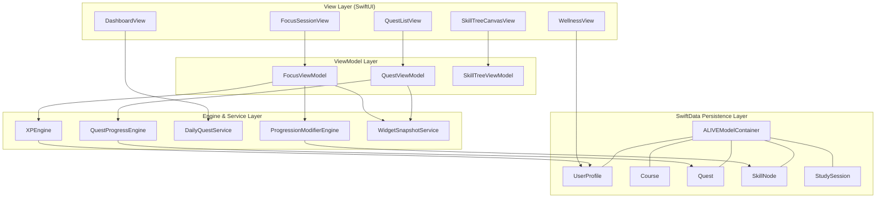

<div align="center">

<br/><br/>

# 🛡️ ALIVE ⚡

### *Gamified Academic & Life Management System for iPhone*

[](https://swift.org)
[](https://apple.com/ios)
[](https://developer.apple.com/xcode/swiftdata/)
[](https://developer.apple.com/design/human-interface-guidelines/)
[](LICENSE)

<br/>

**ALIVE** turns academic routines into an interactive Role-Playing Game (RPG).  
Students build a custom hero, earn XP for completed focus sessions and quests, protect attendance thresholds, unlock progression perks, and monitor momentum from their iPhone, Lock Screen, Dynamic Island, and Home Screen widget.

[Explore Features](#-key-features) • [Architecture](#-system-architecture) • [Getting Started](#-getting-started) • [Testing](#-unit-tests--verification) • [Documentation](#-mathematical--algorithmic-specifications)

</div>

---

## 📋 Table of Contents

- [✨ Core Highlights](#-core-highlights)
- [🌟 Key Features](#-key-features)
  - [🔒 Biometric Authentication & Onboarding](#-biometric-authentication--onboarding)
  - [⚔️ RPG Character Classes & Attribute System](#️-rpg-character-classes--attribute-system)
  - [📊 Attendance Safeguard & Safe Bunk Engine](#-attendance-safeguard--safe-bunk-engine)
  - [📜 Quest System & Dynamic Boss Battles](#-quest-system--dynamic-boss-battles)
  - [🌳 Interactive Skill Tree Canvas](#-interactive-skill-tree-canvas)
  - [⏱️ Deep Work Focus Timer & Live Activities](#️-deep-work-focus-timer--live-activities)
  - [📱 Widgets, Siri & Wellness](#-widgets-siri--wellness)
- [🏗️ System Architecture](#-system-architecture)
  - [Data Flow Diagram](#data-flow-diagram)
  - [Directory Structure](#directory-structure)
- [🧮 Mathematical & Algorithmic Specifications](#-mathematical--algorithmic-specifications)
  - [1. Safe Bunk Margin Formula](#1-safe-bunk-margin-formula)
  - [2. Class Recovery Steps Formula](#2-class-recovery-steps-formula)
  - [3. Exponential XP Level Progression](#3-exponential-xp-level-progression)
- [🚀 Getting Started](#-getting-started)
  - [Prerequisites](#prerequisites)
  - [Build & Execution Guide](#build--execution-guide)
- [🧪 Unit Tests & Verification](#-unit-tests--verification)
- [🤝 Contributing](#-contributing)
- [📄 License](#-license)

---

## ✨ Core Highlights

> [!NOTE]
> **ALIVE** is engineered with pure **SwiftUI**, **SwiftData**, **ActivityKit**, **WidgetKit**, **HealthKit**, **App Intents**, **UserNotifications**, and **LocalAuthentication**. It has no third-party runtime dependencies.

- 🔒 **Biometric Security & Onboarding**: FaceID/TouchID protection for hero profiles and custom character creation.
- 🎭 **4 Playable Character Archetypes**: Distinct starting stat distributions and theme palettes.
- 📐 **Predictive Bunk Calculator**: Real-time algorithm ensuring student attendance stays above required policy thresholds.
- 🌳 **Visual RPG Skill Canvas**: Rendered interactive node trees, perk unlocks, and prerequisite validation.
- 🏝️ **Live Activity & Dynamic Island Integration**: Focus sessions count down on the Lock Screen and Dynamic Island.
- 📱 **Hero HUD Widget**: Level, streak, XP, and quest load are available at a glance.

---

## 🌟 Key Features

### 🔒 Biometric Authentication & Onboarding

Hero profiles are protected with native iOS biometric security ([`AuthService.swift`](ALIVE/Services/AuthService.swift), [`AuthViewModel.swift`](ALIVE/ViewModels/AuthViewModel.swift)):

- 🖐️ **Face ID / Touch ID Verification**: Uses `LocalAuthentication` framework for profile entry.
- 🧙‍♂️ **Character Creation Wizard** ([`CharacterCreationView.swift`](ALIVE/Views/Auth/CharacterCreationView.swift)): Custom username input, archetype selection, and initial quest/skill tree seeding.

---

### ⚔️ RPG Character Classes & Attribute System

Students choose a character class upon initial onboarding ([`CharacterClass.swift`](ALIVE/Models/CharacterClass.swift)). Each class establishes a distinct starting build:

| Character Class | Starting Build | Base Stats (INT / STA / FOC / DIS) |
| :--- | :--- | :---: |
| 📚 **Scholar** | Theory-first | `18 / 12 / 16 / 14` |
| ⚡ **Tech Architect** | Systems-minded | `16 / 14 / 18 / 12` |
| 🎨 **Creative Visionary** | Idea-driven | `14 / 16 / 14 / 16` |
| 🎯 **Academic Strategist** | Planning-oriented | `15 / 13 / 15 / 17` |

#### Character Stat Attributes ([`UserProfile.swift`](ALIVE/Models/UserProfile.swift))
- **Intelligence (INT), Stamina (STA), Focus (FOC), Discipline (DIS)**: Persistent RPG stats that users allocate on level-up and see in their hero HUD.

---

### 📊 Attendance Safeguard & Safe Bunk Engine

The academic attendance engine ([`Course.swift`](ALIVE/Models/Course.swift)) continuously monitors enrolled courses, held lectures, and attended sessions to calculate real-time safety metrics:

- 🟢 **Safe Standing**: Attendance percentage $\ge$ policy requirement (e.g. 75%).
- 🟡 **Warning Buffer**: Displays exact **Max Safe Bunks** remaining.
- 🔴 **Below Threshold**: Computes mandatory **Classes Needed to Recover**.

---

### 📜 Quest System & Dynamic Boss Battles

Task management is structured as RPG Quests ([`Quest.swift`](ALIVE/Models/Quest.swift), [`QuestEngine.swift`](ALIVE/Services/QuestEngine.swift)):

| Quest Category | Availability | Difficulty Tiers | XP Reward | Reward Attributes |
| :--- | :--- | :--- | :---: | :--- |
| ☀️ **Daily Quest** | Refreshed once per calendar day | Novice / Adept | `50 - 120 XP` | Focus / Discipline |
| ⚔️ **Weekly Boss** | Seeded as longer-term goals | Master / Legendary | `250 - 500 XP` | Intelligence / Discipline |
| 📜 **Main Story** | Supported quest type for future milestones | Master | Configurable | Configurable |

---

### 🌳 Interactive Skill Tree Canvas

The skill tree interface ([`SkillTreeCanvasView.swift`](ALIVE/Views/SkillTree/SkillTreeCanvasView.swift)) renders dependency paths. Nodes unlock once the hero has earned the required total XP ([`SkillNode.swift`](ALIVE/Models/SkillNode.swift)):

- 🧠 **Deep Concentration I**: +10% Focus XP Gain *(Tier 1)*.
- 👁️ **Exam Clairvoyance**: Unlocks the seven-day study distribution *(Tier 1)*.
- 🧮 **Master Bunk Calculator**: Attendance-strategy milestone *(Tier 2)*.
- ⚡ **Hyper-Focus Flowstate**: 2x XP bonus on continuous 60m+ focus sessions *(Tier 2)*.
- 🌙 **Circadian Mastery**: Unlocks the recovery ritual *(Tier 3)*.

---

### ⏱️ Deep Work Focus Timer & Live Activities

- Integrated Pomodoro and deep-work timers ([`FocusSessionView.swift`](ALIVE/Views/Focus/FocusSessionView.swift)) award XP only after the countdown completes.
- Streaks and unlocked focus perks are reflected in the claimed reward.
- [`FocusLiveActivityManager.swift`](ALIVE/Services/FocusLiveActivityManager.swift) and the [`ALIVEWidgets`](ALIVE/Extensions/ALIVEWidgets/ALIVEWidgets.swift) extension render a battery-efficient countdown on the Lock Screen and Dynamic Island.

---

### 📱 Widgets, Siri & Wellness

- **WidgetKit** ([`ALIVEWidgets.swift`](ALIVE/Extensions/ALIVEWidgets/ALIVEWidgets.swift)): A Home Screen hero HUD displays level, streak, XP progress, and pending quest count.
- **Siri / Shortcuts** ([`ALIVEAppIntents.swift`](ALIVE/Intents/ALIVEAppIntents.swift)): Start a focus session, open a destination, or complete an eligible quest using App Intents.
- **HealthKit & Notifications** ([`WellnessView.swift`](ALIVE/Views/Wellness/WellnessView.swift)): Opt-in step-count movement context and a user-selected daily focus reminder.

---

## 🏗️ System Architecture

ALIVE is built using **Model-View-ViewModel (MVVM)** with a centralized engine layer for XP calculation, quest processing, and SwiftData model management.

### Data Flow Diagram



---

### Directory Structure

```
alive/
├── ALIVE/
│   ├── App/                    # App entry, router, app delegate, model container
│   ├── Intents/                # App Intents and Shortcuts
│   ├── Models/                 # SwiftData models
│   ├── Services/               # XP, quest, health, notification, widget, and activity services
│   ├── Shared/                 # Live Activity and widget data contracts
│   ├── Theme/                  # Color tokens, glass styling, and particle effect
│   ├── ViewModels/             # Screen-level state and business coordination
│   ├── Views/                  # Dashboard, quests, focus, wellness, academics, skills, badges
│   ├── Extensions/ALIVEWidgets/ # WidgetKit and Dynamic Island extension target
│   └── Tests/                  # SwiftData and gameplay regression tests
├── alive.xcodeproj/            # ALIVE, ALIVEWidgets, and ALIVETests targets
├── Package.swift                # Fast SwiftPM test harness
└── generate_xcodeproj.rb       # Reproducible project-target generator
```

---

## 🧮 Mathematical & Algorithmic Specifications

### 1. Safe Bunk Margin Formula

The safe bunk margin in [`Course.swift`](ALIVE/Models/Course.swift) determines the maximum number of classes a student can miss without falling below the required policy percentage ($R \in (0, 1]$):

$$\frac{A}{H + B} \ge R$$

Where:
- $A$ = Total Classes Attended (`totalClassesAttended`)
- $H$ = Total Classes Held (`totalClassesHeld`)
- $B$ = Safe Bunks Remaining (`maxSafeBunksRemaining`)
- $R$ = Minimum Required Attendance Fraction (`minimumAttendancePercentage / 100.0`)

Solving explicitly for $B$:

$$\text{Max Safe Bunks } (B) = \max\left(0, \left\lfloor \frac{A}{R} \right\rfloor - H\right)$$

---

### 2. Class Recovery Steps Formula

If attendance drops below policy threshold ($A / H < R$), the recovery algorithm calculates the minimum consecutive classes ($N$) required to regain safe standing:

$$\frac{A + N}{H + N} \ge R$$

Solving for $N$:

$$A + N \ge R \cdot H + R \cdot N \implies N(1 - R) \ge R \cdot H - A$$

$$\text{Classes Needed } (N) = \left\lceil \frac{R \cdot H - A}{1 - R} \right\rceil$$

---

### 3. Exponential XP Level Progression

The experience curve required to reach the next level ($L$) is governed by an exponential formula in [`UserProfile.swift`](ALIVE/Models/UserProfile.swift):

$$\text{Required XP}(L) = \left\lfloor 100.0 \times L^{1.4} \right\rfloor$$

#### Sample Progression Table

| Hero Level ($L$) | Required XP for Level Up | Total Cumulative XP |
| :---: | :---: | :---: |
| **Level 1** | 100 XP | 100 XP |
| **Level 2** | 263 XP | 363 XP |
| **Level 5** | 951 XP | 2,434 XP |
| **Level 10** | 2,511 XP | 11,540 XP |
| **Level 20** | 6,628 XP | 53,889 XP |

---

## 🚀 Getting Started

### Prerequisites

| Requirement | Minimum Version | Recommended |
| :--- | :--- | :--- |
| **macOS** | Sonoma 14.0 | Sequoia 15.0+ |
| **Xcode** | Xcode 26.0 | Latest Xcode 26 release |
| **Swift Toolchain** | Swift 5.9 language mode | Toolchain bundled with Xcode |
| **iOS Deployment Target** | iOS 26.5 | Latest iOS runtime |

---

### Build & Execution Guide

1. **Clone Repository**:
   ```bash
   git clone <your-repository-url>
   cd alive
   ```

2. **Open in Xcode**:
   ```bash
   open alive.xcodeproj
   ```

3. **Configure Target Scheme**:
   - Select the **ALIVE** target in Xcode scheme selector.
   - Choose a simulator target (e.g. `iPhone 15 Pro`) or connected physical iOS device.

4. **Compile & Run**:
   - Press `Cmd + R` to build and launch the app.
   - Create a hero for a blank profile, or choose **Demo Mode** on the welcome screen for seeded hackathon data.

---

## 🧪 Unit Tests & Verification

ALIVE features automated unit test coverage across key business components in `ALIVE/Tests`.

```bash
# Fast domain-level test suite
swift test

# Or run the ALIVETests target in Xcode
# Cmd + U
```

### Test Suite Overview

| Test File | Target Under Test | Tested Behaviors & Assertions |
| :--- | :--- | :--- |
| [`AttendanceCalculatorTests.swift`](ALIVE/Tests/AttendanceCalculatorTests.swift) | `Course` | Validates safe bunk ceiling, negative margin bounds, and recovery class steps. |
| [`FocusSessionTests.swift`](ALIVE/Tests/FocusSessionTests.swift) | `FocusViewModel` | Guards completion-only rewards and persists streak-adjusted focus XP. |
| [`QuestProgressEngineTests.swift`](ALIVE/Tests/QuestProgressEngineTests.swift) | `QuestProgressEngine` | Verifies one-time quest rewards, stats, and transactions. |
| [`DailyQuestServiceTests.swift`](ALIVE/Tests/DailyQuestServiceTests.swift) | `DailyQuestService` | Covers same-day idempotence and next-day replacement/streak behavior. |
| [`ProgressionModifierEngineTests.swift`](ALIVE/Tests/ProgressionModifierEngineTests.swift) | `ProgressionModifierEngine` | Verifies focus perk stacking and duration thresholds. |
| [`ALIVERouterTests.swift`](ALIVE/Tests/ALIVERouterTests.swift) | `ALIVERouter` | Covers custom URL and App Intent route consumption. |

---

## 🤝 Contributing

Contributions are welcome! Please follow these guidelines:

1. **Fork the Repository**.
2. **Create a Feature Branch**:
   ```bash
   git checkout -b feature/amazing-feature
   ```
3. **Commit your Changes**:
   ```bash
   git commit -m 'feat: Add amazing feature'
   ```
4. **Push to the Branch**:
   ```bash
   git push origin feature/amazing-feature
   ```
5. **Open a Pull Request**.

---

## 📄 License

This project is licensed under the **MIT License** - see the [LICENSE](LICENSE) file for details.
