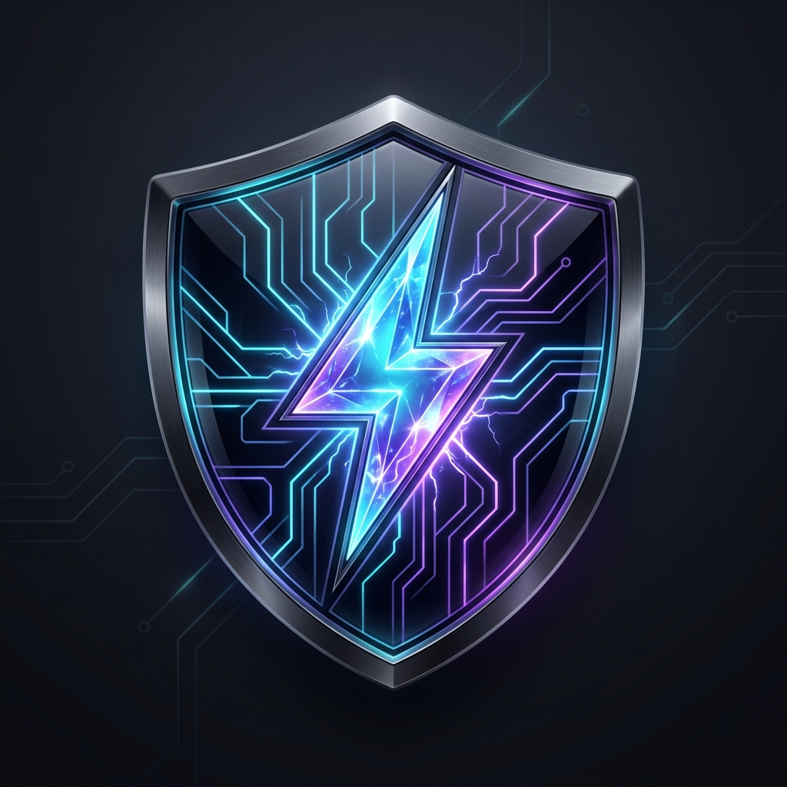
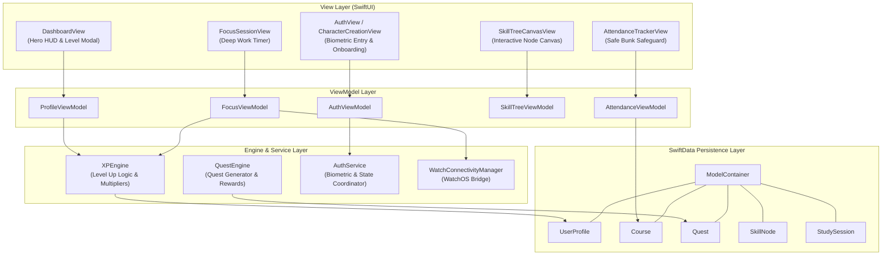

<div align="center">

<br/><br/>

# 🛡️ ALIVE ⚡

### *Gamified Academic & Life Management System for iOS & watchOS*

[](https://swift.org)
[](https://apple.com/ios)
[](https://apple.com/watchos)
[](https://developer.apple.com/xcode/swiftdata/)
[](https://developer.apple.com/design/human-interface-guidelines/)
[](LICENSE)

<br/>

**ALIVE** turns academic routines into an interactive Role-Playing Game (RPG).  
Students build custom hero archetypes, earn experience points (XP) for study sessions, optimize course attendance using exact mathematical algorithms, unlock skill tree perks, and monitor stats on their iPhone, Apple Watch, and Dynamic Island.

[Explore Features](#-key-features) • [Architecture](#-system-architecture) • [Getting Started](#-getting-started) • [Testing](#-unit-tests--verification) • [Documentation](#-mathematical--algorithmic-specifications)

</div>

---

## 📋 Table of Contents

- [✨ Core Highlights](#-core-highlights)
- [🌟 Key Features](#-key-features)
  - [🔒 Biometric Authentication & Onboarding](#-biometric-authentication--onboarding)
  - [⚔️ RPG Character Classes & Attribute System](#️-rpg-character-classes--attribute-system)
  - [📊 Attendance Safeguard & Safe Bunk Engine](#-attendance-safeguard--safe-bunk-engine)
  - [📜 Quest System & Dynamic Boss Battles](#-quest-system--dynamic-boss-battles)
  - [🌳 Interactive Skill Tree Canvas](#-interactive-skill-tree-canvas)
  - [⏱️ Deep Work Focus Timer & Live Activities](#️-deep-work-focus-timer--live-activities)
  - [⌚ watchOS Companion & WidgetKit](#-watchos-companion--widgetkit)
- [🏗️ System Architecture](#-system-architecture)
  - [Data Flow Diagram](#data-flow-diagram)
  - [Directory Structure](#directory-structure)
- [🧮 Mathematical & Algorithmic Specifications](#-mathematical--algorithmic-specifications)
  - [1. Safe Bunk Margin Formula](#1-safe-bunk-margin-formula)
  - [2. Class Recovery Steps Formula](#2-class-recovery-steps-formula)
  - [3. Exponential XP Level Progression](#3-exponential-xp-level-progression)
- [🚀 Getting Started](#-getting-started)
  - [Prerequisites](#prerequisites)
  - [Build & Execution Guide](#build--execution-guide)
- [🧪 Unit Tests & Verification](#-unit-tests--verification)
- [🤝 Contributing](#-contributing)
- [📄 License](#-license)

---

## ✨ Core Highlights

> [!NOTE]
> **ALIVE** is engineered using pure **SwiftUI**, **SwiftData**, **ActivityKit**, **WidgetKit**, **WatchConnectivity**, and **LocalAuthentication**. It runs natively without external third-party dependencies.

- 🔒 **Biometric Security & Onboarding**: FaceID/TouchID protection for hero profiles and custom character creation.
- 🎭 **4 Playable Character Archetypes**: Class-specific passive bonuses, theme color palettes, and base stat distributions.
- 📐 **Predictive Bunk Calculator**: Real-time algorithm ensuring student attendance stays above required policy thresholds.
- 🌳 **Visual RPG Skill Canvas**: Rendered interactive node trees, perk unlocks, and prerequisite validation.
- 🏝️ **Live Activity & Dynamic Island Integration**: Real-time study timer countdowns streamed to Lock Screen.
- 🔄 **Real-Time watchOS Sync**: WCSession bridge streaming hero metrics directly to Apple Watch.

---

## 🌟 Key Features

### 🔒 Biometric Authentication & Onboarding

Hero profiles are protected with native iOS biometric security ([`AuthService.swift`](ALIVE/Services/AuthService.swift), [`AuthViewModel.swift`](ALIVE/ViewModels/AuthViewModel.swift)):

- 🖐️ **Face ID / Touch ID Verification**: Uses `LocalAuthentication` framework for profile entry.
- 🧙‍♂️ **Character Creation Wizard** ([`CharacterCreationView.swift`](ALIVE/Views/Auth/CharacterCreationView.swift)): Custom username input, archetype selection, and initial quest/skill tree seeding.

---

### ⚔️ RPG Character Classes & Attribute System

Students choose a character class upon initial onboarding ([`CharacterClass.swift`](ALIVE/Models/CharacterClass.swift)). Each class grants specific starting attribute values and passive bonuses:

| Character Class | Specialty Description | Base Stats (INT / STA / FOC / DIS) | Passive Bonus |
| :--- | :--- | :---: | :--- |
| 📚 **Scholar** | Master of theory & deep research | `18 / 12 / 16 / 14` | **+15% XP** on deep study sessions |
| ⚡ **Tech Architect** | Builder of complex systems & code | `16 / 14 / 18 / 12` | **+15% XP** on lab timers & projects |
| 🎨 **Creative Visionary** | Designer of visual ideas & concepts | `14 / 16 / 14 / 16` | **+20% bonus** on study streak retention |
| 🎯 **Academic Strategist** | Tactician of exam & attendance planning | `15 / 13 / 15 / 17` | **1 Free Bunk Shield** per course |

#### Character Stat Attributes ([`UserProfile.swift`](ALIVE/Models/UserProfile.swift))
- **Intelligence (INT)**: Enhances study session XP multipliers.
- **Stamina (STA)**: Protects against daily streak decay and focus fatigue.
- **Focus (FOC)**: Increases focus timer completion bonuses.
- **Discipline (DIS)**: Unlocks higher tier daily quest reward multipliers.

---

### 📊 Attendance Safeguard & Safe Bunk Engine

The academic attendance engine ([`Course.swift`](ALIVE/Models/Course.swift)) continuously monitors enrolled courses, held lectures, and attended sessions to calculate real-time safety metrics:

- 🟢 **Safe Standing**: Attendance percentage $\ge$ policy requirement (e.g. 75%).
- 🟡 **Warning Buffer**: Displays exact **Max Safe Bunks** remaining.
- 🔴 **Below Threshold**: Computes mandatory **Classes Needed to Recover**.

---

### 📜 Quest System & Dynamic Boss Battles

Task management is structured as RPG Quests ([`Quest.swift`](ALIVE/Models/Quest.swift), [`QuestEngine.swift`](ALIVE/Services/QuestEngine.swift)):

| Quest Category | Refresh Cycle | Difficulty Tiers | XP Reward | Reward Attributes |
| :--- | :--- | :--- | :---: | :--- |
| ☀️ **Daily Quest** | Every 24 Hours | Novice / Adept | `50 - 120 XP` | Focus / Discipline |
| ⚔️ **Weekly Boss** | Every 7 Days | Master / Legendary | `250 - 500 XP` | Intelligence / Stat Points |
| 📜 **Main Story** | Milestone Driven | Master | `200+ XP` | Skill Points |

---

### 🌳 Interactive Skill Tree Canvas

The skill tree interface ([`SkillTreeCanvasView.swift`](ALIVE/Views/SkillTree/SkillTreeCanvasView.swift)) renders node paths where students spend accumulated XP to unlock abilities ([`SkillNode.swift`](ALIVE/Models/SkillNode.swift)):

- 🧠 **Deep Concentration I**: +10% Focus XP Gain *(Tier 1)*.
- 👁️ **Exam Clairvoyance**: Unlocks advanced historical study analytics *(Tier 1)*.
- 🧮 **Master Bunk Calculator**: Provides +1 Bunk Shield per course *(Tier 2)*.
- ⚡ **Hyper-Focus Flowstate**: 2x XP bonus on continuous 60m+ focus sessions *(Tier 2)*.
- 🌙 **Circadian Mastery**: Stamina decay protection & sleep insights *(Tier 3)*.

---

### ⏱️ Deep Work Focus Timer & Live Activities

- Integrated Pomodoro and continuous deep work timers ([`FocusSessionView.swift`](ALIVE/Views/Focus/FocusSessionView.swift)).
- Real-time focus score calculation based on session stability.
- **ActivityKit Extension** ([`FocusLiveActivityAttributes.swift`](ALIVE/Extension/LiveActivity/FocusLiveActivityAttributes.swift)) streams timer countdowns to the iOS Dynamic Island and Lock Screen.

---

### ⌚ watchOS Companion & WidgetKit

- **WatchConnectivity Manager** ([`WatchConnectivityManager.swift`](ALIVE/WatchApp/WatchConnectivityManager.swift)): Direct bi-directional communication between iPhone and Apple Watch.
- **Glanceable Dashboard** ([`WatchDashboardView.swift`](ALIVE/WatchApp/WatchDashboardView.swift)): Real-time level progress, streak count, and safe bunk indicators on your wrist.
- **WidgetKit Integration** ([`AliveWidgetBundle.swift`](ALIVE/Extension/Widgets/AliveWidgetBundle.swift)): Home screen widgets showing character HUD and upcoming daily quests.

---

## 🏗️ System Architecture

ALIVE is built using **Model-View-ViewModel (MVVM)** with a centralized engine layer for XP calculation, quest processing, and SwiftData model management.

### Data Flow Diagram



---

### Directory Structure

```
major/
└── ALIVE/
    ├── App/
    │   └── ALIVEApp.swift                  # App entry point & SwiftData Container configuration
    ├── Models/                             # SwiftData Persistent @Model Definitions
    │   ├── UserProfile.swift               # Hero stats, level progression, XP calculations
    │   ├── CharacterClass.swift            # Archetypes, base attributes, theme palettes
    │   ├── Course.swift                    # Course metadata & attendance safety logic
    │   ├── Quest.swift                     # Daily/Weekly quest definitions & XP yields
    │   ├── SkillNode.swift                 # Node dependency links, unlock state, perks
    │   ├── StudySession.swift              # Historical focus session records
    │   ├── Achievement.swift               # Badge vault entries & rarity tiers
    │   └── XPTransaction.swift             # Transaction log of experience gains
    ├── Services/                           # Core Business Engines
    │   ├── AuthService.swift               # Biometric authentication & user session state
    │   ├── XPEngine.swift                  # Level-up thresholds & multiplier formulas
    │   ├── QuestEngine.swift               # Quest seed generation & completion handler
    │   ├── MockDataGenerator.swift         # Demo data initializer for fresh installations
    │   └── HapticManager.swift             # iOS haptic engine feedback generator
    ├── ViewModels/                         # SwiftUI State Management Layer
    │   ├── ProfileViewModel.swift          # Hero HUD state & stat point distribution
    │   ├── AttendanceViewModel.swift       # Course list state & safe bunk calculations
    │   ├── FocusViewModel.swift            # Timer countdown logic & Live Activity state
    │   ├── QuestViewModel.swift            # Quest filtering & completion handlers
    │   ├── SkillTreeViewModel.swift        # Skill canvas unlock logic & node trees
    │   ├── AnalyticsViewModel.swift        # Historical study performance aggregations
    │   └── AuthViewModel.swift             # Character creation wizard & authentication state
    ├── Views/                              # UI Presentation Layer
    │   ├── Dashboard/                      # Character HUD, Level Up Modals, XP bar
    │   ├── Academics/                      # Course attendance cards & bunk status
    │   ├── Focus/                          # Focus session timers & analytics views
    │   ├── Quests/                         # Quest list, filter tabs, completion cards
    │   ├── SkillTree/                      # Interactive node canvas & detail views
    │   ├── Achievements/                   # Badge vault grid & unlock overlays
    │   ├── Auth/                           # Sign-in & character creation flow
    │   └── MainTabView.swift               # Primary tab bar navigation
    ├── Theme/                              # Design System & Styling
    │   ├── ColorPalette.swift              # Neon cyberpunk color tokens
    │   ├── GlassCardStyle.swift            # Glassmorphism view modifiers
    │   └── ParticleEffectView.swift        # Canvas particle effect render engine
    ├── Extension/                          # System Framework Extensions
    │   ├── LiveActivity/                   # ActivityKit focus timer attributes
    │   └── Widgets/                        # WidgetKit lockscreen/homescreen widgets
    ├── WatchApp/                           # watchOS App Target
    │   ├── WatchConnectivityManager.swift  # Phone-to-Watch WCSession delegate
    │   └── WatchDashboardView.swift        # watchOS interface
    └── Tests/                              # Automated Unit Test Suite
        ├── AttendanceCalculatorTests.swift # Attendance algorithm verification
        ├── QuestEngineTests.swift          # Quest reward & progress tests
        ├── XPEngineTests.swift             # XP progression & jump calculations
        └── SwiftDataModelTests.swift       # SwiftData container & schema tests
```

---

## 🧮 Mathematical & Algorithmic Specifications

### 1. Safe Bunk Margin Formula

The safe bunk margin in [`Course.swift`](ALIVE/Models/Course.swift) determines the maximum number of classes a student can miss without falling below the required policy percentage ($R \in (0, 1]$):

$$\frac{A}{H + B} \ge R$$

Where:
- $A$ = Total Classes Attended (`totalClassesAttended`)
- $H$ = Total Classes Held (`totalClassesHeld`)
- $B$ = Safe Bunks Remaining (`maxSafeBunksRemaining`)
- $R$ = Minimum Required Attendance Fraction (`minimumAttendancePercentage / 100.0`)

Solving explicitly for $B$:

$$\text{Max Safe Bunks } (B) = \max\left(0, \left\lfloor \frac{A}{R} \right\rfloor - H\right)$$

---

### 2. Class Recovery Steps Formula

If attendance drops below policy threshold ($A / H < R$), the recovery algorithm calculates the minimum consecutive classes ($N$) required to regain safe standing:

$$\frac{A + N}{H + N} \ge R$$

Solving for $N$:

$$A + N \ge R \cdot H + R \cdot N \implies N(1 - R) \ge R \cdot H - A$$

$$\text{Classes Needed } (N) = \left\lceil \frac{R \cdot H - A}{1 - R} \right\rceil$$

---

### 3. Exponential XP Level Progression

The experience curve required to reach the next level ($L$) is governed by an exponential formula in [`UserProfile.swift`](ALIVE/Models/UserProfile.swift):

$$\text{Required XP}(L) = \left\lfloor 100.0 \times L^{1.4} \right\rfloor$$

#### Sample Progression Table

| Hero Level ($L$) | Required XP for Level Up | Total Cumulative XP |
| :---: | :---: | :---: |
| **Level 1** | 100 XP | 100 XP |
| **Level 2** | 263 XP | 363 XP |
| **Level 5** | 951 XP | 2,434 XP |
| **Level 10** | 2,511 XP | 11,540 XP |
| **Level 20** | 6,628 XP | 53,889 XP |

---

## 🚀 Getting Started

### Prerequisites

| Requirement | Minimum Version | Recommended |
| :--- | :--- | :--- |
| **macOS** | Sonoma 14.0 | Sequoia 15.0+ |
| **Xcode** | Xcode 15.0 | Xcode 15.4+ |
| **Swift Toolchain** | Swift 5.9 | Swift 5.10 |
| **iOS Deployment Target** | iOS 17.0 | iOS 17.4+ |
| **watchOS Target** | watchOS 10.0 | watchOS 10.4+ |

---

### Build & Execution Guide

1. **Clone Repository**:
   ```bash
   git clone https://github.com/your-username/major.git
   cd major
   ```

2. **Open in Xcode**:
   ```bash
   open ALIVE/App/ALIVEApp.swift
   # Or open the project root in Xcode
   ```

3. **Configure Target Scheme**:
   - Select the **ALIVE** target in Xcode scheme selector.
   - Choose a simulator target (e.g. `iPhone 15 Pro`) or connected physical iOS device.

4. **Compile & Run**:
   - Press `Cmd + R` to build and launch the app.
   - *Note*: On initial launch, [`MockDataGenerator`](ALIVE/Services/MockDataGenerator.swift) seeds demonstration courses, quests, and character profile automatically.

---

## 🧪 Unit Tests & Verification

ALIVE features automated unit test coverage across key business components in `ALIVE/Tests`.

```bash
# Run unit test suite in Xcode
Cmd + U
```

### Test Suite Overview

| Test File | Target Under Test | Tested Behaviors & Assertions |
| :--- | :--- | :--- |
| [`AttendanceCalculatorTests.swift`](ALIVE/Tests/AttendanceCalculatorTests.swift) | `Course` | Validates safe bunk ceiling, negative margin bounds, and recovery class steps. |
| [`QuestEngineTests.swift`](ALIVE/Tests/QuestEngineTests.swift) | `QuestEngine` | Verifies daily/weekly quest reward scaling and completion transitions. |
| [`XPEngineTests.swift`](ALIVE/Tests/XPEngineTests.swift) | `XPEngine` | Tests multi-level level-ups, stat point allocation, and XP multiplier curves. |
| [`SwiftDataModelTests.swift`](ALIVE/Tests/SwiftDataModelTests.swift) | `ModelContainer` | Verifies in-memory SwiftData container initialization & schema relationships. |

---

## 🤝 Contributing

Contributions are welcome! Please follow these guidelines:

1. **Fork the Repository**.
2. **Create a Feature Branch**:
   ```bash
   git checkout -b feature/amazing-feature
   ```
3. **Commit your Changes**:
   ```bash
   git commit -m 'feat: Add amazing feature'
   ```
4. **Push to the Branch**:
   ```bash
   git push origin feature/amazing-feature
   ```
5. **Open a Pull Request**.

---

## 📄 License

This project is licensed under the **MIT License** - see the [LICENSE](LICENSE) file for details.

